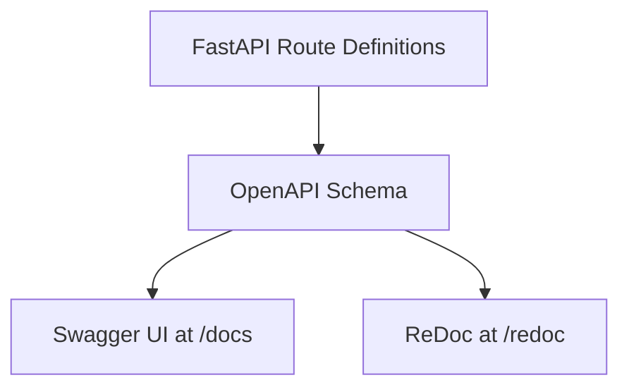

## Introduction

One of the most beginner-friendly features of FastAPI is that it automatically generates API documentation. As soon as you build routes, FastAPI can show them in documentation pages such as Swagger UI and ReDoc.

This is helpful because you do not need to manually write docs just to start testing your endpoints. You get a working interface almost immediately.

## Why This Matters

Backend development is not only about writing code. It is also about making the API understandable and testable.

When you create many endpoints, it becomes hard to remember every path, query parameter, request body, and response shape. Swagger UI and ReDoc solve that problem by turning your API definition into readable documentation.

## Core Idea

FastAPI generates documentation from your code. When you define routes, parameters, and request models, FastAPI uses that information to build an OpenAPI schema. Swagger UI and ReDoc then display that schema in different ways.

The usual documentation URLs are:

- `/docs` for Swagger UI
- `/redoc` for ReDoc
- `/openapi.json` for the raw OpenAPI schema

## A Small Example

```python
from fastapi import FastAPI

app = FastAPI()

@app.get("/users/{user_id}")
def get_user(user_id: int, active: bool = True):
    return {"user_id": user_id, "active": active}
```

## Explanation

This route contains useful metadata for documentation generation:
- the path parameter `user_id`
- the query parameter `active`
- the return structure in JSON form

FastAPI reads this and adds it to the generated docs automatically.

## Swagger UI vs ReDoc

| Tool | Best understood as | Good for |
| ---- | ------------------ | -------- |
| Swagger UI | interactive API playground | testing endpoints directly from the browser |
| ReDoc | cleaner reference-style documentation | reading and understanding API structure |

## How Swagger UI Helps

Swagger UI is available at `/docs`. It is interactive, which means you can:
- open an endpoint section
- see its parameters
- click "Try it out"
- send a request directly
- inspect the response

For a beginner, this is very useful because it creates a tight learning loop. You write code, run the server, open the docs, test the route, and immediately see what changed.

## How ReDoc Helps

ReDoc is available at `/redoc`. It is usually more reading-focused than Swagger UI.

It presents the API in a structured documentation style, which is useful when you want to understand the available endpoints and data models in a more organized format.

## Request to Documentation Flow



This shows an important idea: Swagger UI and ReDoc are not separate manual documents. They are generated from the API structure you define in your code.

## What Improves the Docs

The better your route definitions are, the better your docs become. Things that improve documentation quality include:
- meaningful path names
- clear parameter names
- type hints
- request body models
- response models
- route descriptions and summaries later on

So documentation quality is closely connected to code quality.

## Common Mistakes

### Thinking the docs replace understanding

Swagger UI and ReDoc help a lot, but they do not replace backend knowledge. You still need to understand routing, validation, models, and HTTP concepts.

### Ignoring the OpenAPI schema idea

A beginner may use `/docs` without understanding that it is generated from an OpenAPI definition. Learning this concept is useful because many backend tools rely on the same standard.

### Writing unclear routes

If route names and models are unclear, the generated docs also become unclear. Automatic docs are only as good as the API structure behind them.

## Summary

Swagger UI and ReDoc are built-in documentation tools that make FastAPI especially beginner-friendly. Swagger UI helps you test endpoints interactively, while ReDoc gives you a cleaner reference view. Both are generated automatically from your FastAPI code, which means good API design leads to better documentation.
